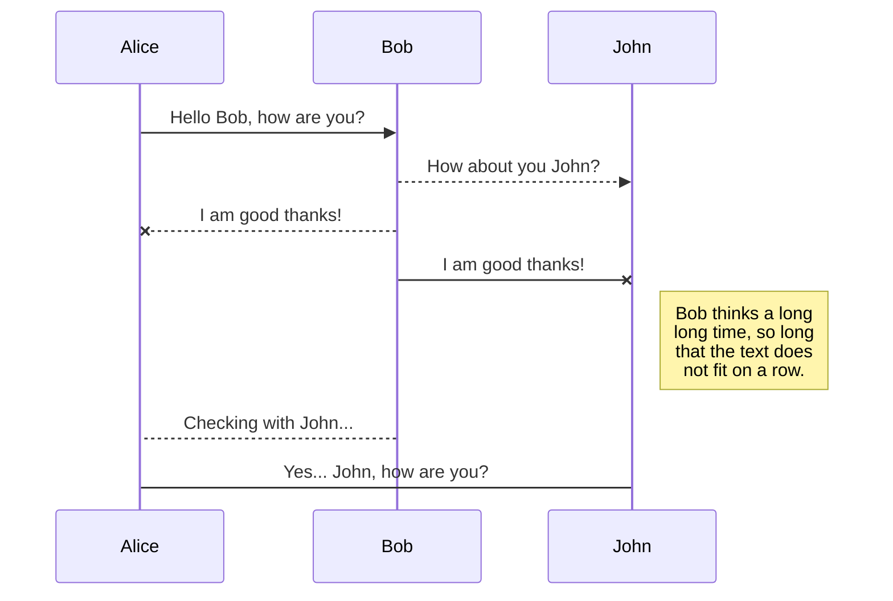
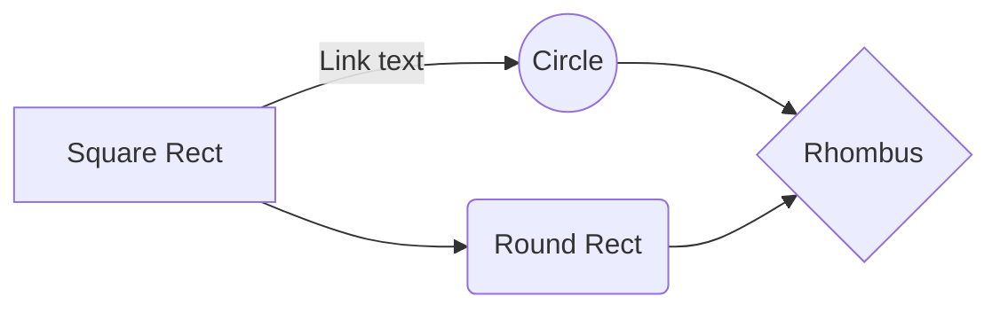

# Welcome to StackEdit!

Hi! I'm your first Markdown file in **StackEdit**. If you want to learn about StackEdit, you can read me. If you want to play with Markdown, you can edit me. Once you have finished with me, you can create new files by opening the **file explorer** on the left corner of the navigation bar.

## 2) Importación de los datos, asignación de roles y tipos de las variables

### Carga de fichero con datos

Se cargó el fichero utilizando la instrucción `read_excel` y se almacenó los datos en la variable `datos`.  El nombre del fichero es `DatosEleccionesEuropeas2019.xlsx`.

**Observaciones:** 
1) Avanzado en la práctica he descubierto que el nombre de la columna  `Age_0-4_Ptge` me daba problemas, así que la que cambiado por `Age_0_4_Ptge` . También verifiqué que no hubiese otra columna que presentará los mismos problemas. 
2) La primera versión de los datos no estaban correctas. Para la variable `PartidoCCAA` había valores duplicados que generaban errores. Sin embargo, yo no tome en cuenta el cambio del fichero ya que tenia la mitad de la práctica hecha. 

### Definición de variables objetivos

Para realizar la práctica se debe definir dos variables objetivos, una binaria o dicotómica y otra continua. 

El objetivo del modelo es predecir si para las próximas elecciones los partidos políticos de derecha (_PP_, _Cs_ y _VOX_) recibirán más votos que los partidos de izquierda (_PSOE_, _Podemos_).

**Variable objetivo binaria**: marco como $1$ si la suma de votos de los partidos políticos de derecha es superior a los partidos de izquierda, $0$ en caso contrario:
```
datos$VotosDerIzq <- ifelse(datos$PP + datos$Cs + datos$VOX > datos$PSOE + datos$Podemos, 1, 0)
```
 **Variable objetivo continua**: es el porcentaje de votos de derecha
 ```
datos$VotosDerPtge <- ((datos$PP + datos$Cs + datos$VOX) * 100) / datos$Censo
```

## 3) Análisis descriptivo del conjunto de datos

Con la instrucción `str(datos)` se observa el tipo de datos de las variables. Se aprecia que las variables `CCAA`, `CodigoINE`, `PartidoMasVotado` y `PartidoCCAA` son de tipo caracter (_chr_). El resto de variables son de tipo numérico (_num_).

Comprobación de valores distintos de las variables cuantitativas, gracias a la instrucción `sapply(Filter...`. Se observa que haya más de $10$ valores para cada variable. Se aprecia que la variable binaria, `VotosDerIzq` tiene pocos valores distintos, por lo tanto es candidato a ser convertido en factor.

 Con la siguiente instrucción `summary(datos)` se aprecia los datos faltantes (_NA_) en las variables: `totalEmpresas`, `Industria`, `Construccion`, `ComercTTEHosteleria`, `Servicios`, `Inmuebles`,
 `PobChange_pct`, `PersonasInmueble` y `Explotaciones`. También se observa que para la variable `SameComAutonPtge` se obtiene un porcentaje máximo superior a $100\%$, lo que es un valor fuera del rango ya que es un porcentaje y no se especificó que tuviese valores superiores al $100\%$. Asumo que el valor por encima de la variable `PobChange_pct` es válido ya que de igual forma puede tomar valores negativos que significa una disminución de población.

 Se observa que para las siguientes variables faltan datos (_missings_)
 ya que no tiene $8110$ registros que es el total de registros: `totalEmpresas`, `Industria`, `Construccion`, `ComercTTEHosteleria`, `Servicios`, `Inmuebles`, `PobChange_pct`, `PersonasInmueble` y `Explotaciones`. La instrucción utilizada ha sido `psych::describe(Filter...`.
 
Se verifican frecuencias (`freq`) de las variables cualitativas. Se detecta que para la variable `CCAA` hay comunidades con muy pocos votos como lo son para _Ceuta_ y _Melilla_. Por lo tanto, hay que hacer correcciones. Para la variable `PartidoCCAA` se observa que solo toma valores entre: _PP_, _PSOE_, _Otro_ y son significativos, por tanto, es candidato a convertirse en factor y no se debe agrupar en categorías. 
```
> freq(datos$CCAA) 
                  n    % val%
Andalucía       773  9.5  9.5
Aragón          731  9.0  9.0
Asturias         78  1.0  1.0
Baleares         67  0.8  0.8
Canarias         88  1.1  1.1
Cantabria       102  1.3  1.3
CastillaLeón   2248 27.7 27.7
CastillaMancha  919 11.3 11.3
Cataluña        947 11.7 11.7
Ceuta             1  0.0  0.0
ComValenciana   542  6.7  6.7
Extremadura     387  4.8  4.8
Galicia         313  3.9  3.9
Madrid          179  2.2  2.2
Melilla           1  0.0  0.0
Murcia           45  0.6  0.6
Navarra         272  3.4  3.4
PaísVasco       243  3.0  3.0
Rioja           174  2.1  2.1

> freq(datos$PartidoCCAA)
        n    % val%
Otro 1652 20.4 20.4
PP   2961 36.5 36.5
PSOE 3497 43.1 43.1
```

He realizo el análisis y cálculos de los demás apartados y me he dado cuenta que la variable `CodigoINE` tiene una dependencia lineal con mis variables objetivos, por lo tanto, es candidata a ser eliminada. 

En la siguiente tabla resumen se puede apreciar todo el detalle de las variables:
|Nombre Variable|Tipo de Dato|Ausentes|Cantidad Registros|Min Valor|Media|Max Valor|
|:---|:---|:---|:---|:---|:---|:---|
|CCAA|chr|No|8110|NA|NA|NA
|CodigoINE |chr|No|8110|NA|NA|NA|
|Censo |num|No|8110|3.00|4353.20|2391391.00|
|VotosEmitidos |num|No|8110|0.00|2798.65|1623866.00|
|Abstenciones|num|No|8110|0.00|1552.56|768322.00|
|Blancos |num|No|8110|0.00|26.75|8211.00|
|Nulos |num|No|8110|0.00|23.96|5511.00|
|Cs|num|No|8110|0.00|338.91|289684.00|
|PP|num|No|8110|0.00|560.92|383846.00|
|PSOE|num|No|8110|0.00|909.96|505814.00|
|VOX |num|No|8110|0.00|173.28|149557.00|
|Podemos |num|No|8110|0.00|279.14|213161.00|
|Otros |num|No|8110|0.00|485.73|373262.00|
|PartidoMasVotado|chr|No|8110|NA|NA|NA
|Population|num|No|8110|5.00|5746.77|3141991.00|
|Age_0_4_Ptge|num|No|8110|0.00|3.02|13.24|
|Age_under19_Ptge|num|No|8110|0.00|13.56|33.70|
|Age_19_65_pct |num|No|8110|23.46|57.37|100.00|
|Age_over65_pct|num|No|8110|0.00|29.08|76.47|
|WomanPopulationPtge |num|No|8110|11.77|47.30|72.68|
|ForeignersPtge|num|No|8110|0.00|6.38|71.47|
|SameComAutonPtge|num|No|8110|0.00|81.62|127.16|
|SameComAutonDiffProvPtge|num|No|8110|0.00|4.34|67.31|
|DifComAutonPtge |num|No|8110|0.00|10.73|100.00|
|UnemployLess25_Ptge |num|No|8110|0.00|7.32|100.00|
|Unemploy25_40_Ptge|num|No|8110|0.00|36.99|100.00|
|UnemployMore40_Ptge |num|No|8110|0.00|50.18|100.00|
|AgricultureUnemploymentPtge |num|No|8110|0.00|8.41|100.00|
|IndustryUnemploymentPtge|num|No|8110|0.00|10.00|100.00|
|ConstructionUnemploymentPtge|num|No|8110|0.00|10.84|100.00|
|ServicesUnemploymentPtge|num|No|8110|0.00|58.64|100.00|
|totalEmpresas |num|Si (5)|8110|0.00|398.95|299397.00|
|Industria |num|Si (187)|7923|0.00|0.04|0.45|
|Construccion|num|Si (138)|7972|0.00|0.06|0.41|
|ComercTTEHosteleria |num|Si (9)|8101|0.00|0.17|0.81|
|Servicios |num|Si (62)|8048|0.00|0.12|0.72|
|Inmuebles |num|Si (5)|8105|6.00|3254.20|1615548.00|
|Superficie|num|No|8110|0.03|62.38|1750.33|
|Densidad|num|No|8110|0.23|186.15|27856.42|
|PobChange_pct |num|Si (7)|8103|-52.27|-4.90|138.46|
|PersonasInmueble|num|Si (5)|8105|0.11|1.30|3.33|
|Explotaciones |num|Si (23)|8087|1.00|122.26|4759.00|
|PartidoCCAA |chr|No|8110|NA|NA|NA
|VotosDerIzq |num|No|8110|0.00|0.49|1.00|
|VotosDerPtge|num|No|8110|0.00|32.57|100.00|
TODO TABLA 1[Table caption, works as a reference][section-mmd-tables-table1]
 
## 4) Corrección de errores

Solucionar valores fuera de rango para la variable `SameComAutonPtge`, ya que no se especifica que puede tomar valores de porcentajes negativos o mayores a $100\%$.
```
datos$SameComAutonPtge <- replace(datos$SameComAutonPtge, which((datos$SameComAutonPtge < 0) | (datos$SameComAutonPtge > 100)), NA)
```
 Convertir la variable `VotosDerIzq` en factor ya que es una variable
 cuantitativa y tiene poco valores distintos.
 ```
datos[,c('VotosDerIzq')] <- lapply(datos[,c('VotosDerIzq')], factor)
```

La variable cualitativa `CCAA` se debe agrupar en nuevas categorías ya que tiene valores para algunas comunidades insuficientes. La idea general es que las representaciones de las comunidades deben tener al menos un $6\%$ de datos como mínimo. Las agrupaciones se harán uniendo los nombres de las comunidades que la conforman y se seleccionaran por su cercanía geográfica. Se agrupa _Ceuta_,  _Melilla_, _Extremadura_ y _Canarias_ en la región de _Andalucía_ ya que no llegan al $6\%$ de los datos cada uno. El grupo se define:  `And_Ceu_Mel_Can_Extr`. De igual forma se agrupan _Murcia_ y _Baleares_ en la _Comunidad Valenciana_ y se llama el grupo `Val_Mur_Bal`. _Asturias_ y _Cantabria_ se unen a _Galicia_ y se define como `Gal_Cant_Ast`. _PaísVasco_ y _Rioja_ se unen a _Navarra_ con el nombre `Nav_PVasc_Rio`. Por último, _Madrid_ se une a _CastillaMancha_ en el grupo `CastManc_Madr`.
```
datos$CCAA <- car::recode(datos$CCAA, 
"'Andalucía'='And_Ceu_Mel_Can_Extr';'Ceuta'='And_Ceu_Mel_Can_Extr';'Melilla'='And_Ceu_Mel_Can_Extr';'Extremadura'='And_Ceu_Mel_Can_Extr';'Canarias'='And_Ceu_Mel_Can_Extr';
'ComValenciana'='Val_Mur_Bal';'Murcia'='Val_Mur_Bal';'Baleares'='Val_Mur_Bal';
'Galicia'='Gal_Cant_Ast';'Cantabria'='Gal_Cant_Ast';'Asturias'='Gal_Cant_Ast';
'Navarra'='Nav_PVasc_Rio';'PaísVasco'='Nav_PVasc_Rio';'Rioja'='Nav_PVasc_Rio';
'CastillaMancha'='CastManc_Madr';'Madrid'='CastManc_Madr'")
```
Luego de realizar la agrupación verifico que para cada categoría hay valores mayores al $6\%$: 
```
> freq(datos$CCAA)
                        n    % val%
And_Ceu_Mel_Can_Extr 1250 15.4 15.4
Aragón                731  9.0  9.0
CastillaLeón         2248 27.7 27.7
CastManc_Madr        1098 13.5 13.5
Cataluña              947 11.7 11.7
Gal_Cant_Ast          493  6.1  6.1
Nav_PVasc_Rio         689  8.5  8.5
Val_Mur_Bal           654  8.1  8.1
```
La categoría más baja es `Gal_Cant_Ast` comprendida por Galicia, Cantabria y Asturias que tiene un valor de $6.1\%$. La más alta es `CastillaLeón` $27.7\%$.

 Se convierte en factor las variables `CCAA` y `PartidoCCAA` ya que tienen pocos valores diferentes:
 ```
datos[,c('CCAA')] <- lapply(datos[,c('CCAA')], factor)
datos[,c('PartidoCCAA')] <- lapply(datos[,c('PartidoCCAA')], factor)
```

## 5) Tratamiento de datos atípicos

Se crean dos variables para almacenar las variables objetivos. Se almacena en la `input` los datos sin las variables objetivos: 
```
varObjCont <- datos$VotosDerPtge
varObjBin <- datos$VotosDerIzq
input <- as.data.frame(select(datos, -c(VotosDerPtge, VotosDerIzq)))
```

Se procede a colocar por ausentes aquellos datos atípicos con la instrucción `outliers`. Para cada variable cuantitativa se sustituye por datos ausentes en el caso de que se encuentren menos del $5\%$ de ellos, en caso contrario no se hace nada. Aparte del porcentaje se ha visto las gráficas mostradas por el programa para realizar un análisis más detallado. Para evitar posibles errores en la ejecución se realizó este proceso $3$ veces para todas las variables. 

### Ausentes (Missings)

 Se obtiene la proporción de missings por variable y observación ya que debemos comprobar que los datos para cada variables son sustanciales, para ello se crea la variable `prop_missings` dentro de la variable `input`.
 
En este caso ninguna observación supera el $50\%$ de ausentes, por lo tanto, se puede afirmar que los datos para cada variable son sustanciales. El máximo valor es de $0.209$:
```
Min.  1st Qu.   Median     Mean  3rd Qu.     Max. 
0.000000 0.000000 0.000000 0.006581 0.000000 0.209302 
```
### Imputación

 Imputo todas las variables cuantitativas, seleccionando el tipo de 
 imputación: aleatorio (_random_), de forma que se eliminen aquellos datos missings utilizando un valor al azar. 
```
input[,as.vector(which(sapply(input, class)=="numeric"))] <- 
   sapply(Filter(is.numeric, input),function(x) impute(x,"random"))
```
Verifico que no me quedan datos missings y que los datos están bien depurados, para ello utilizo las instrucciones `summary(input)` y `str(input)`. Con la primera instrucción verifico que no hay datos ausentes (`NA`) y con la segunda que los tipos de datos son correctos.

Una vez confirmado que los datos están bien depurados procedo a eliminar aquellas variables que están relacionadas con mi variable objetivo, como lo son: `VotosEmitidos`, `Abstenciones`, `Blancos`, `Nulos`, `Cs`, `PP`, `PSOE`, `VOX`, `Podemos`, `Otros` y `PartidoMasVotado`. 

Se elimina también la variable `CodigoINE` ya que tiene una dependencia lineal con mis variables objetivos. 
 
 El `input` final es: 
 ```
 > str(input)
'data.frame':	8110 obs. of  32 variables:
 $ CCAA                        : Factor w/ 8 levels "And_Ceu_Mel_Can_Extr",..: 2 4 5 8 5 3 1 4 4 4 ...
 $ Censo                       : num  18 58 10538 11436 4156 ...
 $ Population                  : num  27 54 13502 14436 5268 ...
 $ Age_0_4_Ptge                : num  0 1.85 4.8 4.99 4.84 ...
 $ Age_under19_Ptge            : num  22.2 3.7 20.9 19.8 19.8 ...
 $ Age_19_65_pct               : num  48.1 53.7 60.3 61.5 59.9 ...
 $ Age_over65_pct              : num  29.6 42.6 18.8 18.7 20.3 ...
 $ WomanPopulationPtge         : num  48.1 38.9 51.3 51.1 50.8 ...
 $ ForeignersPtge              : num  1.42 0 5.37 6.4 3.78 ...
 $ SameComAutonPtge            : num  59.3 75.9 61.8 68.3 74 ...
 $ SameComAutonDiffProvPtge    : num  10.25 7.41 1.04 1.16 1.94 ...
 $ DifComAutonPtge             : num  0 24.1 30.7 22.9 19 ...
 $ UnemployLess25_Ptge         : num  0 0 7.56 5.07 7.64 ...
 $ Unemploy25_40_Ptge          : num  0 0 43.5 39.2 42.4 ...
 $ UnemployMore40_Ptge         : num  100 100 49 55.8 50 ...
 $ AgricultureUnemploymentPtge : num  0 0 0.593 1.027 1.274 ...
 $ IndustryUnemploymentPtge    : num  0 0 13.3 19.9 22.9 ...
 $ ConstructionUnemploymentPtge: num  0 0 13.41 7.05 6.69 ...
 $ ServicesUnemploymentPtge    : num  0 0 65 64.6 62.4 ...
 $ totalEmpresas               : num  0 0 285 782 272 0 788 9 0 0 ...
 $ Industria                   : num  0 0 0.0491 0.0601 0.0993 0 0.0254 0 0 0 ...
 $ Construccion                : num  0 0 0.1754 0.0857 0.1397 ...
 $ ComercTTEHosteleria         : num  0 0 0.495 0.437 0.368 ...
 $ Servicios                   : num  0 0 0.281 0.417 0.393 ...
 $ Inmuebles                   : num  61 133 5679 7724 2680 ...
 $ Superficie                  : num  18.65 77.75 0.93 0.78 2.95 ...
 $ Densidad                    : num  1.448 0.695 14518.28 18507.692 1785.763 ...
 $ PobChange_pct               : num  -16.42 3.85 -1.47 -6.25 -4.18 ...
 $ PersonasInmueble            : num  0.44 0.41 2.38 1.87 1.97 0.42 2.44 0.76 0.34 0.22 ...
 $ Explotaciones               : num  1 1 1 1 1 1 1 1 1 1 ...
 $ PartidoCCAA                 : Factor w/ 3 levels "Otro","PP","PSOE": 2 2 2 2 2 2 2 2 2 2 ...
 $ prop_missings               : num  0.093 0.0233 0 0 0 ...
 ```


## 6) Relación entre variables input y objetivo

### Relación variable objetivo binaria con variables cualitativas
Ejecutando el gráfico del `mosaico_targetbinaria` con la variable binaria objetivo `varObjBin` y la variable `CCAA` se obtiene el siguiente gráfico: 

TODO GRAFICO 1

Del gráfico $1$ se aprecia que en `CastillaLeón` se tiene que la relación es muy grande entre la comunidad autónoma y los votos que obtuvieron partidos de derecha, ya que la barra roja es mayor a la azul, mientras que para el `Nav_PVasc_Rioja` hay más votos a los partidos de izquierda, ya que la barra roja es muy pequeña comparada con la barra azul. Por lo tanto, se puede concluir que la relación entre la variable `CCAA` y la variable objetivo binaria es fuerte. 

Realizando la misma instrucción pero con la variable `PartidoCCAA` se obtiene el gráfico $2$. 

TODO GRAFICO 2

En este caso, la variable `PartidoCCAA`, que significa el partido político que gobierna en la comunidad autónoma en ese momento no guarda relación con la variable binaria de votos de partidos de derecha e izquierda, ya que sus barras tienen casi el mismo tamaño.

### Relación variable objetivo binaria con variables cuantitativas
A continuación el análisis para dos variables cuantitativas: `Age_over65_pct` y `Superficie`. Se utiliza la instrucción `boxplot_targetbinaria`.

TODO GRAFICO 3

En el gráfico $3$ se aprecia que el porcentaje de personas mayores a $65$ años tiene mucha relación con la variable binaria de votos de la derecha e izquierda conseguidos. En detalle, la caja de bigotes azul se encuentra por encima de la caja de bigote roja lo que significa que los votos a partidos de derecha son más frecuentes entre personas mayores a $65$ años.

TODO GRAFICO 4

Se observa para la gráfica $4$ la relación de la variable cuantitativa `Superficie`. La superficie del municipio no tiene mucha relación con la cantidad de votantes de partidos de derecha o izquierda que se pueden obtener, esto se aprecia ya que las tres caja de bigotes parten de la misma altura base, su mediana es casi idéntica y su media es similar, aun a pesar de tener el tercer cuartil diferente.

### Relación variable objetivo continua con todas las variables continuas
Se observa en la gráfica $5$ la relación de las variables cuantitativas con la variable objetivo continua. Las variables `Age_under19_Ptge`, `Age_0_4_Ptge` y `PersonasInmueble` son las que tienen relación negativa más obvia ya que tienen un color rojizo fuerte, lo que significa, que la relación con la variable continua de porcentaje de votos de los partidos de derecha es inversa. En detalle, para la variable `Age_under19_Ptge`, que es el porcentaje de personas menores a $19$ años que pueden votar o familias que votan con hijos menores a $18$ años, su relación es fuertemente negativa y decrece, lo que nos indica que este grupo de personas votaría por partidos de izquierda. Por el contrario, para la variable `Age_over65_pct` la relación es fuertemente positiva, lo que indica que el porcentaje de personas mayores a $65$ años que votan a partidos de derecha es grande y está mostrado por un color azul oscuro. Las siguientes variables son las que se observa que tienen más relación con la variable objetivo continua de forma inversa: `Age_0_4_Ptge`, `Age_under19_Ptge`, `Age_19_65_ptc`,  `WomanPopulationPtge`, `Industria`, `Construccion`, `ComercTTEHosteleria`, `Servicios`, `PobChange_pct` y `PersonasInmueble`. Mientras, que la variable que muestra más relación de forma positiva es `Age_over65_pct`.

TODO GRAFICO 5

### Importancia de las variables (_V de Cramer_)
El estadístico _V de Cramer_ nos permite detectar la relación que existe entre dos variables, acotando sus resultado a la escala entre $0$ y $1$. En el gráfico $6$ se observa las variables que más se relacionan con la variable objetivo binaria. De forma que la variable `CCAA` tiene un valor del $50%$, `Age_under19_Pte`  tiene un $0.32$, seguido de cerca por `Age_over65_pct` con $0.31$ y el resto de variables. Es importante destacar, que las variables `Explotaciones` y `PartidoCCAA` dieron resultados por debajo de las dos variables aleatorias, lo que indica que dichas variables podrían ser inútiles para el modelo ya que si al elegir una variable al azar, sus resultados muestran más relación con la variable binaria que aquellas variables originales entonces se podrían descartar.
 
TODO GRAFICO 6

En el gráfico $7$, para las variables continuas se aprecia una tendencia similar de los resultados pero a la baja. Las variables `CCAA`, `Age_under19_Pte` y `Age_over65_pct` siguen apareciendo en el mismo orden. Esto se puede explicar ya que mi variable objetivo binaria consiste en los votos de los partidos de derecha sobre los votos de partidos de izquierda mientras la variable objetivo continua es el porcentaje de votos de los partidos de derecha, ambas guardan relación. Las dos variables aleatorias arrojan resultados superiores para la variable `PartidoCCAA`.

TODO GRAFICO 7 

Con los resultados obtenidos de los gráficos $6$ y $7$ se podría descartar la variable `PartidoCCAA` ya que en ambos casos tiene valores por debajo de las variables aleatorias. Sin embargo, prefiero no eliminarla por una decisión personal. 

## 7) Modelo de regresión lineal

Antes de realizar el modelo de regresión lineal es importante asegurarnos que las variables input están depurados esto significa:
 1) Asegurarse que tanto las variables objetivos como las input no contienen datos ausentes o missings. 
 2) Las variables input no deben contener datos atípicos, ya que pueden desvirtuar los resultados.
 3) Evitar aquellas variables independientes que estén muy correlacionados ya que que podrían invertir la matrix $X'X$. 
 4) El número de parámetros incluidos en el modelo ha de ser muy inferior al de observaciones, para evitar problemas en la estimación y de sobreajuste.

 Sabemos que el modelo de regresión lineal pretende predecir una variable $y$ (variable objetivo) a partir de un conjunto de $m$ variables $x_i$ (input) a través de la ecuación:
 
 $$y = f(x_1, x_2, ... , x_m) + \epsilon$$

 La simplificación de la ecuación anterior es:
 
 $$\hat{y} = \beta_0 + \beta_1x_1 + \beta_2x_2 + ... + \beta_mx_m$$

 En mi caso la formula anterior vendría representada por:

$$VotosPartidoDerechaPtge = \beta_0 + \beta_1*Age\_under19\_Ptge + ... + \beta_m*Age\_over65\_pct + ... + \epsilon$$

 Donde $n$ y $m$ son enteros positivos pero menores a la totalidad de variables.

Cabe destacar que la fórmula anterior es una simplificación y no tiene en cuenta las interacciones entre las variables.

### Modelo de regresión lineal manual
En este apartado se procede a probar varios modelos en donde se seleccionan las variables basados en su importancia de acuerdo a la información arrojada por _V de Cramer_ para la variable objetivo continua. 

Primero se realiza la partición de los datos en _train_ y _test_ para tener un conjunto de valores a los que aplicar los modelos y tomar mediciones. Para comparar los modelos se usará la medida $R^2$ o suma de cuadrados de los errores. Se espera tener valores cercanos a $1$ ya que mejora la bondad del ajuste. También, se busca que el valor del $R^2\ train$ y $R^2\ test$ sean muy parecidos ya que nos garantiza fiabilidad, para ello se cálcula la diferencia entre ambas y se llama $\Delta\ R^2$. Por último, se valora la cantidad de variables del modelo (complejidad) ya que nos permite simplificar la interpretación del mismo y así facilita la obtención de datos en el futuro. 

|Nombre Modelo|Variables introducidas|$R^2\ train$|$R^2\ test$|$\Delta\ R^2$|Complejidad|Comentario|
|:---|:---|:---|:---|:---|:---|:---|
|_Modelo 1_|Todas|$0.5851544$|$0.6044848$|$0.01933$|$42$|Es el modelo con mejor dato para $R^2\ train$ pero mayor complejidad|
|_Modelo 2_|`CCAA` `Age_under19_Ptge` `Age_over65_pct` `PersonasInmueble` `Age_0_4_Ptge` `Servicios` `ComercTTEHosteleria`|$0.5660609$|$0.5897057$|$0.02364$|$14$||
|_Modelo 3_|_Modelo 2_ + `Construccion` `ServicesUnemploymentPtge` `UnemployMore40_Ptge` `Unemploy25_40_Ptge`|$0.5745172$|$0.5949663$|$0.02044$|$18$||
|_Modelo 4_|_Modelo 3_ + `Age_19_65_pct` `Industria` `PobChange_pct` `WomanPopulationPtge`|$0.5755794$|$0.5954471$|$0.01986$|$22$||
|_Modelo 5_|_Modelo 4_ + `UnemployLess25_Ptge` `IndustryUnemploymentPtge` `Superficie` `SameComAutonDiffProvPtge`|$0.5794009$|$0.600151$|$0.02075$|$26$||
|_Modelo 6_|_Modelo 5_ + `SameComAutonPtge` `ConstructionUnemploymentPtge` `AgricultureUnemploymentPtge` `ForeignersPtge` `Explotaciones`|$0.5840761$|$0.6046245$|$0.02054$|$31$||
|_Modelo 7_|_Modelo 6_ + `DifComAutonPtge` `Densidad`|$0.5845147$|$0.6048381$|$0.02032$|$33$|Es el modelo con mejor $R^2\ test$|
|_Modelo 8_|_Modelo 7_ - `CCAA`|$0.3105017$|$0.362801$|$0.05229$|$26$|La eliminación de la variable más importante del modelo `CCAA` empeora mucho el modelo|
|_Modelo 9_|_Modelo 2_ - `Age_0_4_Ptge`|$0.5660495$|$0.5899167$|$0.02386$|$13$|La diferencia de los $\Delta\ R^2$ entre este modelo y el Modelo 2 es muy pequeña por tanto se puede usar este modelo ya que tiene menos complejidad|
|_Modelo 10_|`CCAA`|$0.5219683$|$0.530841$|$0.00887$|$8$|Modelo con menor complejidad y menor $\Delta\ R^2$|
TODO TABLA 2[Table caption, works as a reference][section-mmd-tables-table1]

Desde los modelos $2$ al $7$ la tendencia a medida que se van agregando más variables es que mejora la bondad del ajuste del mismo para $R^2\ train$ y $R^2\ test$. Por otro lado, en general, la variable `CCAA` permanece como la más importante y se mantiene con respecto a las demás variables.

Analizando las complejidades de los modelos y las bondades del ajuste para cada modelo se obtiene que el mejor modelo es el _Modelo 9_ ya que la diferencia entre éste modelo y el modelo con la mejor bondad del ajuste, _Modelo 1_, no es significativa, sólo de un $0.014$ pero su complejidad es mucho más baja, en el _Modelo 9_ es de $13$ variables mientras en el _Modelo 1_ es de $42$. Por el principio de parsimonia se puede afirmar que el mejor modelo es el _Modelo 9_.

Del modelo ganador se aprecia que tiene un $R^2\ train$ de $0.5660495$ y $R^2\ test$ de $0.5899167$. Lo que nos da una diferencia de $0.02386$. Se puede decir que el modelo es bastante fiable ya que se comporta de forma similar para los conjuntos de datos en _test_ y _train_. Adicionalmente, la variables que usa el modelo no son excesivas, sólo 13. Lo que nos permite simplificar la interpretación del modelo. 

Observo los coeficientes del _Modelo 9_ y la importancia de las variables en la gráfica $8$.
```
> coef(modelo9)
     (Intercept)          CCAAAragón    CCAACastillaLeón   CCAACastManc_Madr        CCAACataluña 
      32.2072016           4.9285833          12.8441282           7.6312992         -21.1182203 
CCAAGal_Cant_Ast   CCAANav_PVasc_Rio     CCAAVal_Mur_Bal    Age_under19_Ptge      Age_over65_pct 
       1.3308214          -8.9904299           3.0950148          -0.2570178           0.1326130 
PersonasInmueble           Servicios ComercTTEHosteleria 
      -1.0736828           2.3649846          -6.0905217 
```
Para las variables categóricas la interpretación debe tomar en cuenta aquella categoría que no se muestra en los coeficientes, así que en los coeficientes mostrados la categoría faltante es `CCAAAndalucía`, de manera que la interpretación se hace comparando las categorías mostradas con la faltante. Por ejemplo, para la variable `CCAAAragón` se ha obtenido $4.92$, lo que significa que para un voto que se obtenga en dicha comunidad se aumenta en un $4.92\%$ los votos de la derecha en comparación con los votos obtenidos en la comunidad autónoma de Andalucí­a, `CCAAAndalucía`, por otro lado, para la comunidad autónoma `CCAACataluña` se observa que se tiene un valor de $-21.11$ lo que indica que un voto que se realice en esa comunidad autónoma disminuye en un $-21.11\%$ los votos de la derecha en comparación con los votos en Andalucía. En el caso de las variables continuas, la interpretación se hace tomando en cuenta la variable de estudio y la variable continua objetivo. Por ejemplo, para la variable `Age_under19_Ptge` se tiene un valor de $-0.25$, lo que significa que del porcentaje de personas que votan con edades menores a $19$ años o familias votantes que tengan hijos menores a $18$ años, se disminuye un $0.25\%$ el porcentaje de votos que recibe los partidos de derecha. De forma análoga se puede realizar la interpretación del resto de variables solo hay que tener en cuenta si la variable es continua o categórica. 


TODO GRAFICA 9

Se observa en la gráfica $9$ que la importancia de las variables viene dada en primer lugar por `CCAA` con $0.296$, seguido de `Age_under19_Ptge` con $0.002$, luego `Age_over65_pct` $0.002$, `ComercTTEHosteleria` con $0.0016$, `PersonasInmueble` con $0.0005$ y `Servicios` con $0.00010$. 


### Modelo con transformaciones y discretizadas
El modelo manual se ha realizado pero sin transformar las variables inputs es por ello que los resultados conseguidos para algunas de ellas podrán no ser los más óptimos. Es por ello que se hace necesario probar ahora el modelo introduciendo las siguientes transformaciones $X$, $log(X)$, $e^X$, $X^2$, $\sqrt{X}$, $X^4$, $\sqrt[4]{X}$. Cabe destacar, que la transformación sólo se realizará para las variables cuantitativas. 

 Adicionalmente, la discretización permite capturar relaciones complejas (no lineales) entre las variables de entrada y la variable objetivo, por lo tanto, también se agregan al estudio. 

Se realizan las transformaciones de las variables cuantitativas utilizando la variable objetivo continua gracias a la instrucción `Transf_Auto`. Se unen las discretizaciones de las variables utilizando la función `optbin` y luego se almacenan en un data frame. Por último, se usa la instrucción `createDataPartition` para crear dos conjuntos de datos para realizar las mediciones de los modelos llamados _train_ y _test_.

Los tres métodos a utilizar para la selección de variables son _Forward_, _Backward_ y _Stepwise_. Y los métodos de medición alternativos son _AIC_ (Akaike information criterion) y _SBC_ (Schwarz criterion) aunque `R` lo llame _BIC_. 

### Variables originales
|Nombre Modelo|Variables introducidas|$R^2\ test$|Complejidad|Comentario|
|:---|:---|:---|:---|:---|
|_ModeloStepAIC_|Originales|$0.5941304$|$25$|Este modelo es mejor que el _ModeloBackAIC_ ya la diferencia de las bondades del ajuste son muy pequeñas, sólo de $0.00051$ y este tiene menos complejidad|
|_ModeloBackAIC_|Originales|$0.5946408$|$27$||
TODO TABLA 3[Table caption, works as a reference][section-mmd-tables-table1]

|Nombre Modelo|Variables introducidas|$R^2\ test$|Complejidad|Comentario|
|:---|:---|:---|:---|:---|
|_ModeloStepBIC_|Originales|$0.5946924$|$18$||
|_ModeloBackBIC_|Originales|$0.5946924$|$18$|El modelo anterior y este son iguales, se elige el modelo anterior|
TODO TABLA 4[Table caption, works as a reference][section-mmd-tables-table1]

 Se observa que las complejidades para los modelos _ModeloStepAIC_ y _ModeloStepBIC_ son diferentes, para el primero es $25$ y para el segundo $18$, y las bondades del ajuste son $0.5941304$ y $0.5946924$ respectivamente. Dado que la diferencia de las bondades del ajuste es tan pequeña, $0.00056$, se elige el modelo _ModeloStepBIC_ por el principio de parsimonia. 

### Interacciones con las variables originales 

|Nombre Modelo|Variables introducidas|$R^2\ test$|Complejidad|
|:---|:---|:---|:---|:---|
|_ModeloStepAIC_Int_|Originales-Interacciones|$0.6303501$|$135$|
|_ModeloStepBIC_Int_|Originales-Interacciones|$0.6087072$|$35$|
TODO TABLA 5[Table caption, works as a reference][section-mmd-tables-table1]

En el modelo _ModeloStepAIC_Int_ la bondad del ajuste ha sido de $0.6303501$ mientras que el modelo _ModeloStepBIC_Int_ es de $0.6087072$. En el caso de las complejidades tenemos que son $135$ y $35$ respectivamente. De forma, que se elige el modelo _ModeloStepBIC_Int_ ya que la diferencia de bondades del ajuste es sólo $0.021$, pero su complejidad es mucho menor. Por el principio de parsimonia, es preferible el _ModeloStepBIC_Int_.

### Transformadas con las variables originales 
|Nombre Modelo|Variables introducidas|$R^2\ test$|Complejidad|
|:---|:---|:---|:---|:---|
|_ModeloStepAIC_Trans_|Originales-Transformaciones|$0.607605$|$34$|
|_ModeloStepBIC_Trans_|Originales-Transformaciones|$0.6002378$|$15$|
TODO TABLA 6[Table caption, works as a reference][section-mmd-tables-table1]

Las bondades del ajuste de ambos modelos han sido $0.607605$ para el modelo _ModeloStepAIC_Trans_ y $0.6002378$ para el modelo _ModeloStepBIC_Trans_. Sus variables fueron $34$ y $15$ respectivamente. Se puede decir que el modelo _ModeloStepBIC_Trans_ es mejor ya que la diferencia de las bondades del ajuste son muy pequeñas, sólo $0.0073$ y su complejidad es menor. Por el principio de parsimonia, es preferible el _ModeloStepBIC_Trans_.

### Comparando modelos con variables originales y las transformadas 

#### _ModeloStepAIC_ vs _ModeloStepAIC_Trans_
 Si se comparan las bondades del ajuste para los modelos _ModeloStepAIC_ y _ModeloStepAIC_Trans_ se obtiene una diferencia de $0.013$, las complejidades de los modelos han sido de $25$ a $34$ respectivamente. Por el principio de parsimonia se tomaría el modelo _ModeloStepAIC_.
#### _ModeloStepBIC_ y _ModeloStepBIC_Trans_
 Si se comparan las bondades del ajuste para los modelos _ModeloStepBIC_ y _ModeloStepBIC_Trans_ se obtiene una diferencia de $0.0055$, las complejidades de los modelos han sido de $18$ a $15$ respectivamente. Aunque hay una mejora de la complejidad del modelo transformado _ModeloStepBIC_Trans_ no se lo toma en cuenta ya que la diferencia de las bondades del ajuste es muy pequeña y su interpretación mucho más compleja. Por el principio de parsimonia se tomaría el modelo _ModeloStepBIC_.
 
 Se aprecian de los modelos transformados y sin transformar que 
 las posibles mejoras en los índices de bondades del ajuste ($R^2$) para 
 los primeros no son tan altos comparados con los 
 modelos sin transformar y que su interpretación es mucho más compleja, por lo tanto, se prefiere usar los modelos
 sin transformar. 

### Variables originales, transformados y discretizados
|Nombre Modelo|Variables introducidas|$R^2\ test$|Complejidad|
|:---|:---|:---|:---|:---|
|_ModeloStepAIC_Disc_|Originales-Interacciones|$0.604728$|$63$|
|_ModeloStepBIC_Disc_|Originales-Interacciones|$0.6002378$|$15$|
TODO TABLA 7[Table caption, works as a reference][section-mmd-tables-table1]

Se aprecia una mejora para el modelo _ModeloStepAIC_Disc_ de $0.604728$ en comparación con el modelo _ModeloStepBIC_Disc_ de $0.6002378$ y las variables son $63$ y $15$ respectivamente. Dado que la diferencia de las bondades de ajuste es sólo $0.0044$ se escoge el modelo _ModeloStepBIC_Disc_ ya que tiene menos variables y por tanto tiene menos complejidad. 

### Comparando modelos con variables originales y las discretizadas
#### _ModeloStepBIC_ y _ModeloStepBIC_Trans_
 Dado que no queda claro que modelo sea el mejor se analizan sus
 bondades de ajuste y variables (complejidad). El modelo _ModeloStepBIC_Disc_ mejora las bondades del ajuste $0.6002378$ sobre $0.5946924$ del modelo _ModeloStepBIC_. La diferencia de bondades del ajuste es de $0.0055$, menos de un $1\%$, por lo tanto, se debe evaluar las variables que usan, para el modelo _ModeloStepBIC_ es de $18$ mientras para _ModeloStepBIC_Trans_ es $15$, una pequeña mejora. Dado que la diferencia de bondades del ajuste es pequeña al igual que las complejidades se toma como ganador el modelo _ModeloStepBIC_ ya que su interpretación es más sencilla. 

### Todas las variables e interacciones
El valor de bondad del ajuste obtenido ha sido de $0.6421221$ y las variables que utiliza es $55$. Adicionalmente, la formula del modelo es bastante más compleja. 

#

### Lasso

### Elección mejor modelo


**Observación**: según la tercera premisa de los modelos lineales que menciona que las variables input no deben estar muy correlacionadas entre si ya que podrían invertir la matrix $X'X$, se observa en el gráfico $5$ que hay varias de ellas que no cumplen esta regla, como lo son: `Censo-Population`, `Censo-totalEmpresas`, `Censo-Inmuebles`, `Population-totalEmpresas`, `Population-Inmuebles` y `Construccion-ComercTTEHosteleria`. Se ha hecho la prueba eliminando las variables `Censo`, `Construccion`, `Population` en todos los modelos anteriores y se ha observado que el cambio algunas veces ha mejorado o empeorado pero por muy poco. Dado que no hay una mejora sustancial he decidido descartar la eliminación. 


## 8) Modelo de regresión logística


# Files

StackEdit stores your files in your browser, which means all your files are automatically saved locally and are accessible **offline!**

## Create files and folders

The file explorer is accessible using the button in left corner of the navigation bar. You can create a new file by clicking the **New file** button in the file explorer. You can also create folders by clicking the **New folder** button.

## Switch to another file

All your files and folders are presented as a tree in the file explorer. You can switch from one to another by clicking a file in the tree.

## Rename a file

You can rename the current file by clicking the file name in the navigation bar or by clicking the **Rename** button in the file explorer.

## Delete a file

You can delete the current file by clicking the **Remove** button in the file explorer. The file will be moved into the **Trash** folder and automatically deleted after 7 days of inactivity.

## Export a file

You can export the current file by clicking **Export to disk** in the menu. You can choose to export the file as plain Markdown, as HTML using a Handlebars template or as a PDF.


# Synchronization

Synchronization is one of the biggest features of StackEdit. It enables you to synchronize any file in your workspace with other files stored in your **Google Drive**, your **Dropbox** and your **GitHub** accounts. This allows you to keep writing on other devices, collaborate with people you share the file with, integrate easily into your workflow... The synchronization mechanism takes place every minute in the background, downloading, merging, and uploading file modifications.

There are two types of synchronization and they can complement each other:

- The workspace synchronization will sync all your files, folders and settings automatically. This will allow you to fetch your workspace on any other device.
	> To start syncing your workspace, just sign in with Google in the menu.

- The file synchronization will keep one file of the workspace synced with one or multiple files in **Google Drive**, **Dropbox** or **GitHub**.
	> Before starting to sync files, you must link an account in the **Synchronize** sub-menu.

## Open a file

You can open a file from **Google Drive**, **Dropbox** or **GitHub** by opening the **Synchronize** sub-menu and clicking **Open from**. Once opened in the workspace, any modification in the file will be automatically synced.

## Save a file

You can save any file of the workspace to **Google Drive**, **Dropbox** or **GitHub** by opening the **Synchronize** sub-menu and clicking **Save on**. Even if a file in the workspace is already synced, you can save it to another location. StackEdit can sync one file with multiple locations and accounts.

## Synchronize a file

Once your file is linked to a synchronized location, StackEdit will periodically synchronize it by downloading/uploading any modification. A merge will be performed if necessary and conflicts will be resolved.

If you just have modified your file and you want to force syncing, click the **Synchronize now** button in the navigation bar.

> **Note:** The **Synchronize now** button is disabled if you have no file to synchronize.

## Manage file synchronization

Since one file can be synced with multiple locations, you can list and manage synchronized locations by clicking **File synchronization** in the **Synchronize** sub-menu. This allows you to list and remove synchronized locations that are linked to your file.


# Publication

Publishing in StackEdit makes it simple for you to publish online your files. Once you're happy with a file, you can publish it to different hosting platforms like **Blogger**, **Dropbox**, **Gist**, **GitHub**, **Google Drive**, **WordPress** and **Zendesk**. With [Handlebars templates](http://handlebarsjs.com/), you have full control over what you export.

> Before starting to publish, you must link an account in the **Publish** sub-menu.

## Publish a File

You can publish your file by opening the **Publish** sub-menu and by clicking **Publish to**. For some locations, you can choose between the following formats:

- Markdown: publish the Markdown text on a website that can interpret it (**GitHub** for instance),
- HTML: publish the file converted to HTML via a Handlebars template (on a blog for example).

## Update a publication

After publishing, StackEdit keeps your file linked to that publication which makes it easy for you to re-publish it. Once you have modified your file and you want to update your publication, click on the **Publish now** button in the navigation bar.

> **Note:** The **Publish now** button is disabled if your file has not been published yet.

## Manage file publication

Since one file can be published to multiple locations, you can list and manage publish locations by clicking **File publication** in the **Publish** sub-menu. This allows you to list and remove publication locations that are linked to your file.


# Markdown extensions

StackEdit extends the standard Markdown syntax by adding extra **Markdown extensions**, providing you with some nice features.

> **ProTip:** You can disable any **Markdown extension** in the **File properties** dialog.


## SmartyPants

SmartyPants converts ASCII punctuation characters into "smart" typographic punctuation HTML entities. For example:

|                |ASCII                          |HTML                         |
|----------------|-------------------------------|-----------------------------|
|Single backticks|`'Isn't this fun?'`            |'Isn't this fun?'            |
|Quotes          |`"Isn't this fun?"`            |"Isn't this fun?"            |
|Dashes          |`-- is en-dash, --- is em-dash`|-- is en-dash, --- is em-dash|


## KaTeX

You can render LaTeX mathematical expressions using [KaTeX](https://khan.github.io/KaTeX/):

The *Gamma function* satisfying $\Gamma(n) = (n-1)!\quad\forall n\in\mathbb N$ is via the Euler integral

$$
\Gamma(z) = \int_0^\infty t^{z-1}e^{-t}dt\,.
$$

> You can find more information about **LaTeX** mathematical expressions [here](http://meta.math.stackexchange.com/questions/5020/mathjax-basic-tutorial-and-quick-reference).


## UML diagrams

You can render UML diagrams using [Mermaid](https://mermaidjs.github.io/). For example, this will produce a sequence diagram:



And this will produce a flow chart:


<!--stackedit_data:
eyJoaXN0b3J5IjpbMTk2Mzk2MDU0MiwtMzQ0MDk4NjA3LDE5Mj
cyMzgzMDIsMTA1NTIzNjYwMywtNTc3MDQ1Mjk4LC05NzU5NDEx
NTIsMjEwNDI4MjYsLTQ3NTEwODQyOSw5MzIxNTE5NzUsMTYwMz
U5MTkyNywxNjU0NzE5MTY0LDEwMzYxNzQxMzYsMTMwOTU1MzQw
LC0xNzY3ODg2NDU4LC0xNzY3ODg2NDU4LC04ODAxMjE0OTIsLT
EwNTM3MjQxMDUsMTgxMjk5NDk4MiwxMTcxMjIwMjU5LC0xNjk0
NDc2NjMxXX0=
-->