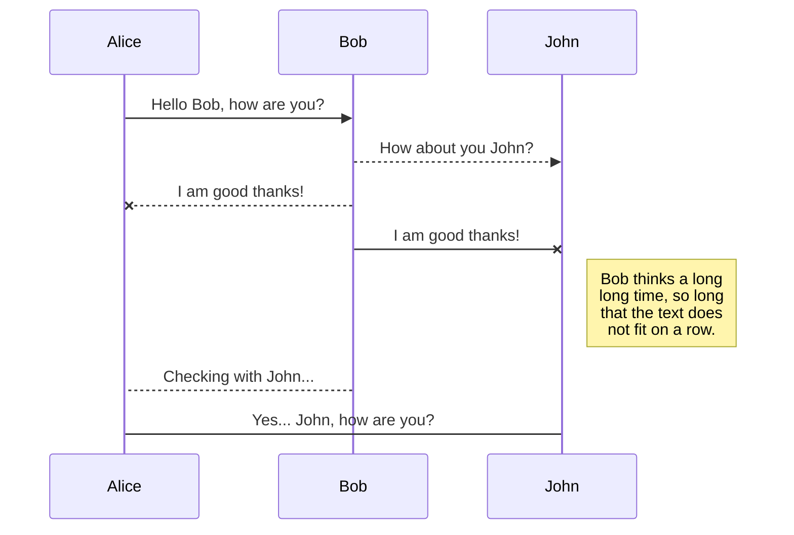
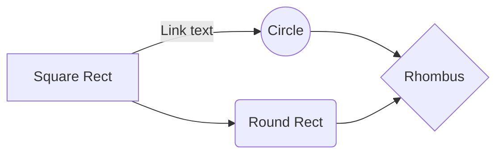

# Welcome to StackEdit!

Hi! I'm your first Markdown file in **StackEdit**. If you want to learn about StackEdit, you can read me. If you want to play with Markdown, you can edit me. Once you have finished with me, you can create new files by opening the **file explorer** on the left corner of the navigation bar.

## 2) Importación de los datos, asignación de roles y tipos de las variables

### Carga de fichero con datos

Se cargó el fichero utilizando la instrucción `read_excel` y se almacenó los datos en la variable `datos`.  El nombre del fichero es `DatosEleccionesEuropeas2019.xlsx`.

**Observación:** Avanzado en la práctica he descubierto que el nombre de la columna  `Age_0-4_Ptge` me daba problemas, así que la que cambiado por `Age_0_4_Ptge` . También verifiqué que no hubiese otra columna que presentará los mismos problemas. 

### Definición de variables objetivos

Para realizar la práctica se debe definir dos variables objetivos, una binaria o dicotómica y otra continua. 

El objetivo del modelo es predecir si para las próximas elecciones los partidos políticos de derecha (_PP_, _Cs_ y _VOX_) recibirán más votos que los partidos de izquierda (_PSOE_, _Podemos_).

**Variable objetivo binaria**: marco como $1$ si la suma de votos de los partidos políticos de derecha es superior a los partidos de izquierda, $0$ en caso contrario:
```
datos$VotosDerIzq <- ifelse(datos$PP + datos$Cs + datos$VOX > datos$PSOE + datos$Podemos, 1, 0)
```
 **Variable objetivo continua**: es el porcentaje de votos de derecha
 ```
datos$VotosDerPtge <- ((datos$PP + datos$Cs + datos$VOX) * 100) / datos$Censo
```

## 3) Análisis descriptivo del conjunto de datos

Con la instrucción `str(datos)` se observa el tipo de datos de las variables. Se aprecia que las variables `CCAA`, `CodigoINE`, `PartidoMasVotado` y `PartidoCCAA` son de tipo caracter (_chr_). El resto de variables son de tipo numérico (_num_).

Comprobación de valores distintos de las variables cuantitativas, gracias a la instrucción `sapply(Filter...`. Se observa que haya más de $10$ valores para cada variable. Se aprecia que la variable binaria, `VotosDerIzq` tiene pocos valores distintos, por lo tanto es candidato a ser convertido en factor.

 Con la siguiente instrucción `summary(datos)` se aprecia los datos faltantes (_NA_) en las variables: `totalEmpresas`, `Industria`, `Construccion`, `ComercTTEHosteleria`, `Servicios`, `Inmuebles`,
 `PobChange_pct`, `PersonasInmueble` y `Explotaciones`. También se observa que para la variable `SameComAutonPtge` se obtiene un porcentaje máximo superior a $100\%$, lo que es un valor fuera del rango ya que es un porcentaje y no se especificó que tuviese valores superiores al $100\%$. Asumo que el valor por encima de la variable `PobChange_pct` es válido ya que de igual forma puede tomar valores negativos que significa una disminución de población.

 Se observa que para las siguientes variables faltan datos (_missings_)
 ya que no tiene $8110$ registros que es el total de registros: `totalEmpresas`, `Industria`, `Construccion`, `ComercTTEHosteleria`, `Servicios`, `Inmuebles`, `PobChange_pct`, `PersonasInmueble` y `Explotaciones`. La instrucción utilizada ha sido `psych::describe(Filter...`.
 
Se verifican frecuencias (`freq`) de las variables cualitativas. Se detecta que para la variable `CCAA` hay comunidades con muy pocos votos como lo son para _Ceuta_ y _Melilla_. Por lo tanto, hay que hacer correcciones. Para la variable `PartidoCCAA` se observa que solo toma valores entre: _PP_, _PSOE_ y _Otro_, por tanto, es candidato a convertirse en factor. 

He realizo el análisis y cálculos de los demás apartados y me he dado cuenta que la variable `CodigoINE`tiene una dependencia lineal con mis variables objetivos, por lo tanto, es candidata a ser eliminada. 

En la siguiente tabla se puede apreciar todo el detalle de las variables:
|Nombre Variable|Tipo de Dato|Ausentes|Cantidad Registros|
|:---|:---|:---|:---|
|CCAA|chr|No|8110
|CodigoINE |chr|No|8110
|Censo |num|No|8110
|VotosEmitidos |num|No|8110
|Abstenciones|num|No|8110
|Blancos |num|No|8110
|Nulos |num|No|8110
|Cs|num|No|8110
|PP|num|No|8110
|PSOE|num|No|8110
|VOX |num|No|8110
|Podemos |num|No|8110
|Otros |num|No|8110
|PartidoMasVotado|chr|No|8110
|Population|num|No|8110
|Age_0_4_Ptge|num|No|8110
|Age_under19_Ptge|num|No|8110
|Age_19_65_pct |num|No|8110
|Age_over65_pct|num|No|8110
|WomanPopulationPtge |num|No|8110
|ForeignersPtge|num|No|8110
|SameComAutonPtge|num|No|8110
|SameComAutonDiffProvPtge|num|No|8110
|DifComAutonPtge |num|No|8110
|UnemployLess25_Ptge |num|No|8110
|Unemploy25_40_Ptge|num|No|8110
|UnemployMore40_Ptge |num|No|8110
|AgricultureUnemploymentPtge |num|No|8110
|IndustryUnemploymentPtge|num|No|8110
|ConstructionUnemploymentPtge|num|No|8110
|ServicesUnemploymentPtge|num|No|8110
|totalEmpresas |num|Si (5)|8110
|Industria |num|Si (187)|8105  
|Construccion|num|Si (138)|8110
|ComercTTEHosteleria |num|Si (9)|8110
|Servicios |num|Si (62)|8110
|Inmuebles |num|Si (5)|8110
|Superficie|num|No|8110
|Densidad|num|No|8110
|PobChange_pct |num|Si (7)|8110
|PersonasInmueble|num|Si (5)|8110
|Explotaciones |num|Si (23)|8110
|PartidoCCAA |chr|No|8110
|VotosDerIzq |num|No|8110
|VotosDerPtge|num|No|8110
 
## 4) Corrección de errores

Solucionar valores fuera de rango para la variable `SameComAutonPtge`, ya que no se especifica que puede tomar valores de porcentajes negativos o mayores a $100\%$.
```
datos$SameComAutonPtge <- replace(datos$SameComAutonPtge, which((datos$SameComAutonPtge < 0) | (datos$SameComAutonPtge > 100)), NA)
```
 Convertir la variable `VotosDerIzq` en factor ya que es una variable
 cuantitativa y tiene poco valores distintos.
 ```
datos[,c('VotosDerIzq')] <- lapply(datos[,c('VotosDerIzq')], factor)
```

La variable cualitativa `CCAA` se debe agrupar en nuevas categorías ya que tiene valores para algunas comunidades insuficientes. La idea general es que las representaciones de las comunidades deben tener al menos un $6\%$ de datos como mínimo. Las agrupaciones se harán uniendo los nombres de las comunidades que la conforman y se seleccionaran por su cercanía geográfica. Se agrupa _Ceuta_,  _Melilla_, _Extremadura_ y _Canarias_ en la región de _Andalucía_ ya que no llegan al $6\%$ de los datos cada uno. El grupo se define:  `And_Ceu_Mel_Can_Extr`. De igual forma se agrupan _Murcia_ y _Baleares_ en la _Comunidad Valenciana_ y se llama el grupo `Val_Mur_Bal`. _Asturias_ y _Cantabria_ se unen a _Galicia_ y se define como `Gal_Cant_Ast`. _PaísVasco_ y _Rioja_ se unen a _Navarra_ con el nombre `Nav_PVasc_Rio`. Por último, _Madrid_ se une a _CastillaMancha_ en el grupo `CastManc_Madr`.
```
datos$CCAA <- car::recode(datos$CCAA, 
"'Andalucía'='And_Ceu_Mel_Can_Extr';'Ceuta'='And_Ceu_Mel_Can_Extr';'Melilla'='And_Ceu_Mel_Can_Extr';'Extremadura'='And_Ceu_Mel_Can_Extr';'Canarias'='And_Ceu_Mel_Can_Extr';
'ComValenciana'='Val_Mur_Bal';'Murcia'='Val_Mur_Bal';'Baleares'='Val_Mur_Bal';
'Galicia'='Gal_Cant_Ast';'Cantabria'='Gal_Cant_Ast';'Asturias'='Gal_Cant_Ast';
'Navarra'='Nav_PVasc_Rio';'PaísVasco'='Nav_PVasc_Rio';'Rioja'='Nav_PVasc_Rio';
'CastillaMancha'='CastManc_Madr';'Madrid'='CastManc_Madr'")
```
Luego de realizar la agrupación verifico que para cada categoría hay valores mayores al $6\%$: 
```
> freq(datos$CCAA)
                        n    % val%
And_Ceu_Mel_Can_Extr 1250 15.4 15.4
Aragón                731  9.0  9.0
CastillaLeón         2248 27.7 27.7
CastManc_Madr        1098 13.5 13.5
Cataluña              947 11.7 11.7
Gal_Cant_Ast          493  6.1  6.1
Nav_PVasc_Rio         689  8.5  8.5
Val_Mur_Bal           654  8.1  8.1
```
La categoría más baja es `Gal_Cant_Ast` comprendida por Galicia, Cantabria y Asturias que tiene un valor de $6.1\%$. La más alta es `CastillaLeón` $27.7\%$.

 Se convierte en factor las variables `CCAA` y `PartidoCCAA` ya que tienen pocos valores diferentes:
 ```
datos[,c('CCAA')] <- lapply(datos[,c('CCAA')], factor)
datos[,c('PartidoCCAA')] <- lapply(datos[,c('PartidoCCAA')], factor)
```

## 5) Tratamiento de datos atípicos

Se crean dos variables para almacenar las variables objetivos. Se almacena en la `input` los datos sin las variables objetivos: 
```
varObjCont <- datos$VotosDerPtge
varObjBin <- datos$VotosDerIzq
input <- as.data.frame(select(datos, -c(VotosDerPtge, VotosDerIzq)))
```

Se procede a colocar por ausentes aquellos datos atípicos con la instrucción `outliers`. Para cada variable cuantitativa se sustituye por datos ausentes en el caso de que se encuentren menos del $5\%$ de ellos, en caso contrario no se hace nada. Aparte del porcentaje se ha visto las gráficas mostradas por el programa para realizar un análisis más detallado. Para evitar posibles errores en la ejecución se realizó este proceso $3$ veces para todas las variables. 

### Ausentes (Missings)

 Se obtiene la proporción de missings por variable y observación ya que debemos comprobar que los datos para cada variables son sustanciales, para ello se crea la variable `prop_missings` dentro de la variable `input`.
 
En este caso ninguna observación supera el $50\%$ de ausentes, por lo tanto, se puede afirmar que los datos para cada variable son sustanciales. El máximo valor es de $0.209$:
```
Min.  1st Qu.   Median     Mean  3rd Qu.     Max. 
0.000000 0.000000 0.000000 0.006581 0.000000 0.209302 
```
### Imputación

 Imputo todas las variables cuantitativas, seleccionando el tipo de 
 imputación: aleatorio (_random_), de forma que se eliminen aquellos datos missings utilizando un valor al azar. 
```
input[,as.vector(which(sapply(input, class)=="numeric"))] <- 
   sapply(Filter(is.numeric, input),function(x) impute(x,"random"))
```
Verifico que no me quedan datos missings y que los datos están bien depurados, para ello utilizo las instrucciones `summary(input)` y `str(input)`. Con la primera instrucción verifico que no hay datos ausentes (`NA`) y con la segunda que los tipos de datos son correctos.

Una vez confirmado que los datos están bien depurados procedo a eliminar aquellas variables que están relacionadas con mi variable objetivo, como lo son: `VotosEmitidos`, `Abstenciones`, `Blancos`, `Nulos`, `Cs`, `PP`, `PSOE`, `VOX`, `Podemos`, `Otros` y `PartidoMasVotado`. 

Se elimina también la variable `CodigoINE` ya que tiene una dependencia lineal con mis variables objetivos. 
 
 El `input` final es: 
 ```
 > str(input)
'data.frame':	8110 obs. of  32 variables:
 $ CCAA                        : Factor w/ 8 levels "And_Ceu_Mel_Can_Extr",..: 2 4 5 8 5 3 1 4 4 4 ...
 $ Censo                       : num  18 58 10538 11436 4156 ...
 $ Population                  : num  27 54 13502 14436 5268 ...
 $ Age_0_4_Ptge                : num  0 1.85 4.8 4.99 4.84 ...
 $ Age_under19_Ptge            : num  22.2 3.7 20.9 19.8 19.8 ...
 $ Age_19_65_pct               : num  48.1 53.7 60.3 61.5 59.9 ...
 $ Age_over65_pct              : num  29.6 42.6 18.8 18.7 20.3 ...
 $ WomanPopulationPtge         : num  48.1 38.9 51.3 51.1 50.8 ...
 $ ForeignersPtge              : num  1.42 0 5.37 6.4 3.78 ...
 $ SameComAutonPtge            : num  59.3 75.9 61.8 68.3 74 ...
 $ SameComAutonDiffProvPtge    : num  10.25 7.41 1.04 1.16 1.94 ...
 $ DifComAutonPtge             : num  0 24.1 30.7 22.9 19 ...
 $ UnemployLess25_Ptge         : num  0 0 7.56 5.07 7.64 ...
 $ Unemploy25_40_Ptge          : num  0 0 43.5 39.2 42.4 ...
 $ UnemployMore40_Ptge         : num  100 100 49 55.8 50 ...
 $ AgricultureUnemploymentPtge : num  0 0 0.593 1.027 1.274 ...
 $ IndustryUnemploymentPtge    : num  0 0 13.3 19.9 22.9 ...
 $ ConstructionUnemploymentPtge: num  0 0 13.41 7.05 6.69 ...
 $ ServicesUnemploymentPtge    : num  0 0 65 64.6 62.4 ...
 $ totalEmpresas               : num  0 0 285 782 272 0 788 9 0 0 ...
 $ Industria                   : num  0 0 0.0491 0.0601 0.0993 0 0.0254 0 0 0 ...
 $ Construccion                : num  0 0 0.1754 0.0857 0.1397 ...
 $ ComercTTEHosteleria         : num  0 0 0.495 0.437 0.368 ...
 $ Servicios                   : num  0 0 0.281 0.417 0.393 ...
 $ Inmuebles                   : num  61 133 5679 7724 2680 ...
 $ Superficie                  : num  18.65 77.75 0.93 0.78 2.95 ...
 $ Densidad                    : num  1.448 0.695 14518.28 18507.692 1785.763 ...
 $ PobChange_pct               : num  -16.42 3.85 -1.47 -6.25 -4.18 ...
 $ PersonasInmueble            : num  0.44 0.41 2.38 1.87 1.97 0.42 2.44 0.76 0.34 0.22 ...
 $ Explotaciones               : num  1 1 1 1 1 1 1 1 1 1 ...
 $ PartidoCCAA                 : Factor w/ 3 levels "Otro","PP","PSOE": 2 2 2 2 2 2 2 2 2 2 ...
 $ prop_missings               : num  0.093 0.0233 0 0 0 ...
 ```


# Files

StackEdit stores your files in your browser, which means all your files are automatically saved locally and are accessible **offline!**

## Create files and folders

The file explorer is accessible using the button in left corner of the navigation bar. You can create a new file by clicking the **New file** button in the file explorer. You can also create folders by clicking the **New folder** button.

## Switch to another file

All your files and folders are presented as a tree in the file explorer. You can switch from one to another by clicking a file in the tree.

## Rename a file

You can rename the current file by clicking the file name in the navigation bar or by clicking the **Rename** button in the file explorer.

## Delete a file

You can delete the current file by clicking the **Remove** button in the file explorer. The file will be moved into the **Trash** folder and automatically deleted after 7 days of inactivity.

## Export a file

You can export the current file by clicking **Export to disk** in the menu. You can choose to export the file as plain Markdown, as HTML using a Handlebars template or as a PDF.


# Synchronization

Synchronization is one of the biggest features of StackEdit. It enables you to synchronize any file in your workspace with other files stored in your **Google Drive**, your **Dropbox** and your **GitHub** accounts. This allows you to keep writing on other devices, collaborate with people you share the file with, integrate easily into your workflow... The synchronization mechanism takes place every minute in the background, downloading, merging, and uploading file modifications.

There are two types of synchronization and they can complement each other:

- The workspace synchronization will sync all your files, folders and settings automatically. This will allow you to fetch your workspace on any other device.
	> To start syncing your workspace, just sign in with Google in the menu.

- The file synchronization will keep one file of the workspace synced with one or multiple files in **Google Drive**, **Dropbox** or **GitHub**.
	> Before starting to sync files, you must link an account in the **Synchronize** sub-menu.

## Open a file

You can open a file from **Google Drive**, **Dropbox** or **GitHub** by opening the **Synchronize** sub-menu and clicking **Open from**. Once opened in the workspace, any modification in the file will be automatically synced.

## Save a file

You can save any file of the workspace to **Google Drive**, **Dropbox** or **GitHub** by opening the **Synchronize** sub-menu and clicking **Save on**. Even if a file in the workspace is already synced, you can save it to another location. StackEdit can sync one file with multiple locations and accounts.

## Synchronize a file

Once your file is linked to a synchronized location, StackEdit will periodically synchronize it by downloading/uploading any modification. A merge will be performed if necessary and conflicts will be resolved.

If you just have modified your file and you want to force syncing, click the **Synchronize now** button in the navigation bar.

> **Note:** The **Synchronize now** button is disabled if you have no file to synchronize.

## Manage file synchronization

Since one file can be synced with multiple locations, you can list and manage synchronized locations by clicking **File synchronization** in the **Synchronize** sub-menu. This allows you to list and remove synchronized locations that are linked to your file.


# Publication

Publishing in StackEdit makes it simple for you to publish online your files. Once you're happy with a file, you can publish it to different hosting platforms like **Blogger**, **Dropbox**, **Gist**, **GitHub**, **Google Drive**, **WordPress** and **Zendesk**. With [Handlebars templates](http://handlebarsjs.com/), you have full control over what you export.

> Before starting to publish, you must link an account in the **Publish** sub-menu.

## Publish a File

You can publish your file by opening the **Publish** sub-menu and by clicking **Publish to**. For some locations, you can choose between the following formats:

- Markdown: publish the Markdown text on a website that can interpret it (**GitHub** for instance),
- HTML: publish the file converted to HTML via a Handlebars template (on a blog for example).

## Update a publication

After publishing, StackEdit keeps your file linked to that publication which makes it easy for you to re-publish it. Once you have modified your file and you want to update your publication, click on the **Publish now** button in the navigation bar.

> **Note:** The **Publish now** button is disabled if your file has not been published yet.

## Manage file publication

Since one file can be published to multiple locations, you can list and manage publish locations by clicking **File publication** in the **Publish** sub-menu. This allows you to list and remove publication locations that are linked to your file.


# Markdown extensions

StackEdit extends the standard Markdown syntax by adding extra **Markdown extensions**, providing you with some nice features.

> **ProTip:** You can disable any **Markdown extension** in the **File properties** dialog.


## SmartyPants

SmartyPants converts ASCII punctuation characters into "smart" typographic punctuation HTML entities. For example:

|                |ASCII                          |HTML                         |
|----------------|-------------------------------|-----------------------------|
|Single backticks|`'Isn't this fun?'`            |'Isn't this fun?'            |
|Quotes          |`"Isn't this fun?"`            |"Isn't this fun?"            |
|Dashes          |`-- is en-dash, --- is em-dash`|-- is en-dash, --- is em-dash|


## KaTeX

You can render LaTeX mathematical expressions using [KaTeX](https://khan.github.io/KaTeX/):

The *Gamma function* satisfying $\Gamma(n) = (n-1)!\quad\forall n\in\mathbb N$ is via the Euler integral

$$
\Gamma(z) = \int_0^\infty t^{z-1}e^{-t}dt\,.
$$

> You can find more information about **LaTeX** mathematical expressions [here](http://meta.math.stackexchange.com/questions/5020/mathjax-basic-tutorial-and-quick-reference).


## UML diagrams

You can render UML diagrams using [Mermaid](https://mermaidjs.github.io/). For example, this will produce a sequence diagram:



And this will produce a flow chart:


<!--stackedit_data:
eyJoaXN0b3J5IjpbNDQ1NzQ1NjAsLTEyMTcyMDY4NDMsLTU1Nz
U0Nzg4MSwyMDg3ODc5NzksLTIwNzMxNTk1NCwtMjA3MDcyNzEw
MCwtMTA3NTk5ODU0OV19
-->